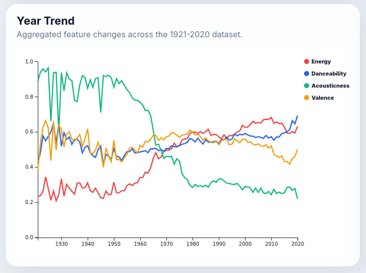
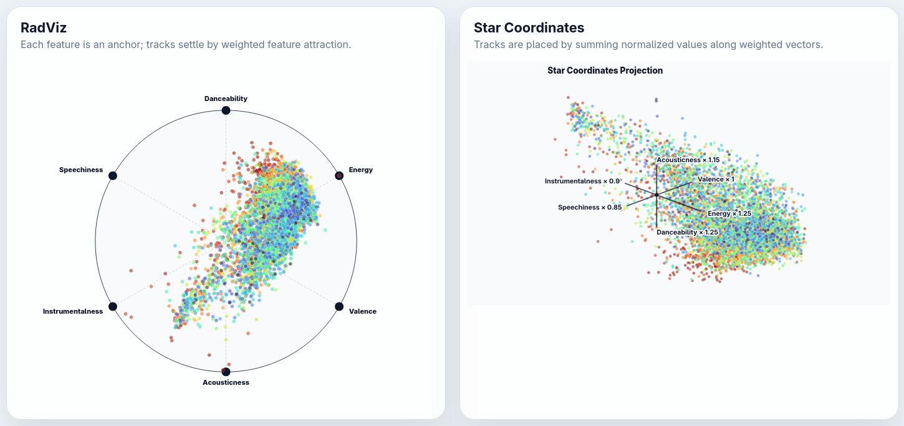
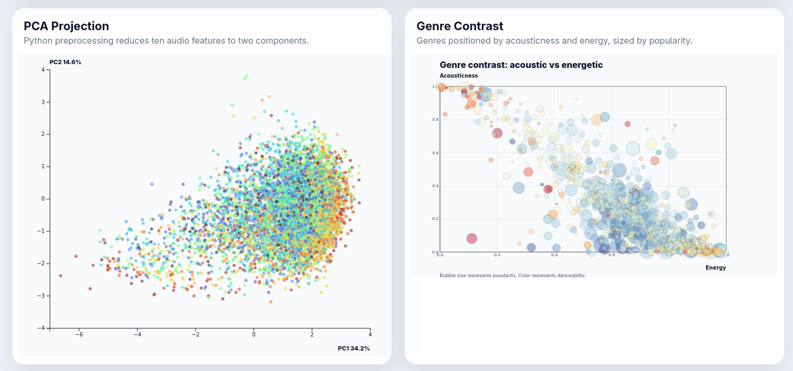
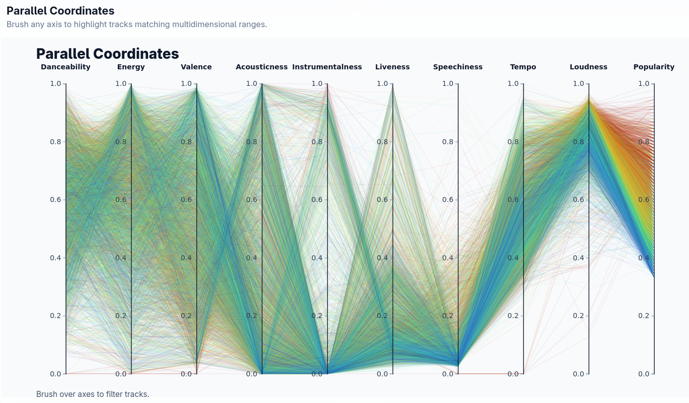

# Multidimensional Visualization - Spotify Audio Feature Explorer

Interactive multidimensional visualization system for exploring relationships between Spotify audio features across tracks, genres, and years using D3.js and Flask.

Draft of visualizations on:  [Observable draft prototype](https://observablehq.com/@snah/draft-spoty-viz)

---

## Installation

### Normal venv

```bash
python -m venv .venv
source .venv/bin/activate
pip install -r requirements.txt
python src/process_data.py
flask --app app run --debug
```

### Micromamba or Conda

```bash
micromamba create -f environment.yml
micromamba run -n spotify-viz python src/process_data.py
micromamba run -n spotify-viz flask --app app run --debug
```

Open <http://127.0.0.1:5000>.

When the page opens, choose a random sample size. The maximum is `15000` tracks to keep D3 visualizations responsive. The `New Random Sample` button generates a fresh sample and overwrites the previous runtime sample.

---

## Overview

This project explores how Spotify tracks evolve and cluster through multidimensional audio features such as energy, danceability, valence, acousticness, speechiness, instrumentalness, loudness, tempo, popularity, and liveness.

The system combines dimensionality reduction, multidimensional projections, and interactive filtering techniques to reveal structural patterns inside the Spotify dataset.

The application was designed around three core analytical goals:

1. Understand how musical characteristics evolved from 1921 to 2020.
2. Discover clusters and relationships between audio features.
3. Analyze how genres distribute across multidimensional feature spaces.

---

## Analytical Tasks

### 1. Temporal Evolution of Music

How have Spotify audio characteristics changed over time?

The year trend view explores long-term changes in energy, danceability, acousticness, and valence using aggregated yearly statistics.

#### Main Findings

- Energy steadily increases from the 1960s onward, reflecting the rise of electronically amplified and heavily produced music.
- Acousticness sharply decreases over time, suggesting a transition from acoustic instrumentation toward digital and synthetic production.
- Danceability increases gradually, especially after the 1990s.
- Valence decreases slightly after 2005, suggesting that recent popular tracks tend to sound less bright or emotionally positive.



---

### 2. Multidimensional Structure of Tracks

How do tracks cluster when projected from high-dimensional audio space?

The system uses PCA Projection, RadViz, and Star Coordinates to analyze latent relationships between tracks and audio attributes.

#### PCA Projection

The PCA projection reveals a dense central cluster with elongated distributions toward energetic and acoustic extremes. Most tracks share common mainstream characteristics, while outliers represent niche or highly specialized musical styles.

#### RadViz

RadViz shows how tracks gravitate toward anchors representing dominant audio characteristics. A strong relationship appears between energy, danceability, and valence, while acoustic and instrumental tracks separate toward different regions.

#### Star Coordinates

Star Coordinates reveal directional relationships between features. Energy and danceability strongly influence the dominant cluster orientation, while acousticness forms an opposing direction.





---

### 3. Genre and Feature Relationships

How do genres differ across multidimensional feature distributions?

The genre contrast bubble plot compares acousticness, energy, danceability, and popularity simultaneously.

#### Main Findings

- Genres with high energy tend to have low acousticness.
- Highly acoustic genres cluster near low-energy regions.
- Popular genres occupy central-to-high energy regions.
- Danceability adds additional separation inside energetic genres.

This visualization highlights how genres naturally organize across audio feature dimensions.

---

## Parallel Coordinates Analysis

The Parallel Coordinates view enables direct multidimensional comparison across all normalized audio features.

Interactive brushing allows filtering tracks by ranges across multiple axes simultaneously.

#### Main Findings

- Popular tracks tend to combine high loudness, medium/high energy, and moderate danceability.
- Instrumentalness remains near zero for most mainstream tracks.
- Speechiness and liveness show sparse distributions with strong concentration near lower values.
- Brushing reveals correlations between energy, loudness, and popularity.


